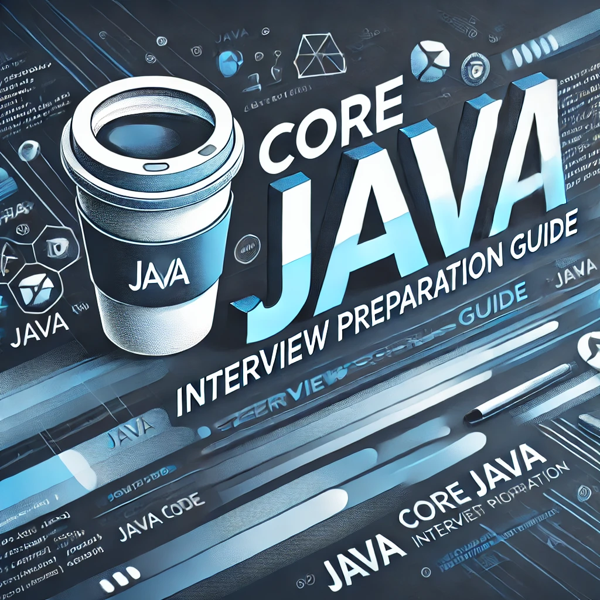

# Core Java Interview Preparation Guide

    

Welcome to the **Core Java Interview Preparation Guide**! This repository is dedicated to helping you ace your Java interviews by covering the most essential and frequently asked questions. Whether you're a beginner or an experienced Java developer, this guide will provide you with concise and accurate answers, along with code snippets to reinforce your knowledge.

## What's Inside?

In this guide, you'll find answers to key Java concepts, including:

- Java fundamentals (data types, operators, and control flow)
- Object-oriented programming principles
- Exception handling
- JVM architecture and memory management
- Important features of Java and comparison with other languages
- Java reserved words and naming conventions
- Commonly used interview questions with explanations

Each section is designed to give you a clear understanding of Java topics commonly asked in interviews.

## Getting Started

Simply browse the questions and answers below, or jump directly to specific topics to quickly revise key Java concepts. All the content is written in markdown for easy readability, and you can clone the repository to practice on your system.

## Java Interview Q&A

To get started with the detailed interview Q&A, check out the following sections:

- [Chapter-1](./Chapters/chapter-1.md)

---

Feel free to use this guide as your go-to reference for Java interview preparation! Happy coding, and good luck with your interviews! 🚀
